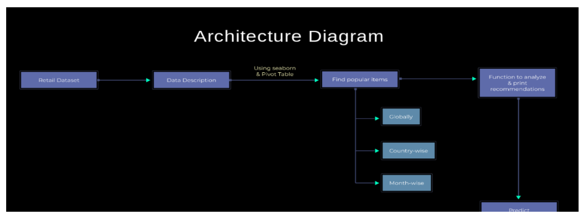

# Online Retail Recommendation System

A popularity-based recommendation system built with Python, Pandas, and Seaborn to analyze transactional data and suggest top-selling products. This project was completed as part of an internship at Plasmid Innovation Pvt. Ltd.

## Table of Contents
- [Project Overview](#project-overview)
- [Features](#features)
- [Dataset](#dataset)
- [Architecture](#architecture)
- [Installation and Usage](#installation-and-usage)
- [Results](#results)
- [Limitations and Future Work](#limitations-and-future-work)

## Project Overview
This project focuses on analyzing an online retail dataset to build a recommendation system. Instead of complex personalization, this system leverages a popularity-based approach to identify best-selling items globally, by country, and by month, providing valuable insights for inventory and marketing strategies.

## Features
- **Global Recommendations:** Identifies the top N most popular items across all sales data.
- **Country-Wise Recommendations:** Provides targeted recommendations by filtering sales data for a specific country.
- **Month-Wise Recommendations:** Analyzes seasonal trends by generating top-selling items for any given month and year.
- **Data Visualization:** Uses Seaborn and Matplotlib to create clear bar charts illustrating the top products.

## Dataset
The project uses the "Online Retail" dataset from the UCI Machine Learning Repository. It contains transactional data from a UK-based online retailer between 2010 and 2011.

- **Source:** [UCI Machine Learning Repository: Online Retail Data Set](https://archive.ics.uci.edu/ml/datasets/Online+Retail)
- **Note:** The dataset (`OnlineRetail.csv`) is not included in this repository due to its size. Please download it from the source link and place it in a `data/` directory.

## Architecture
The system follows a simple data pipeline: Data Loading -> Preprocessing & Cleaning -> Analysis (Popularity Logic) -> Recommendation Output.



## Installation and Usage
To run this project locally, follow these steps:

1. **Clone the repository:**
   ```bash
   git clone https://github.com/your-username/Online-Retail-Recommendation-System.git
   cd Online-Retail-Recommendation-System
